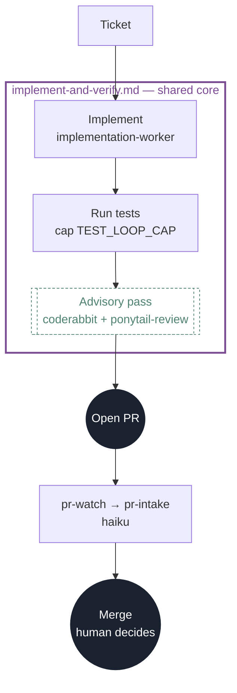
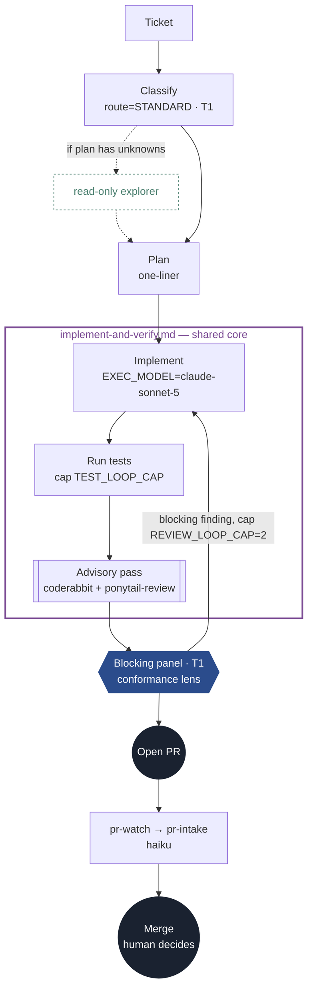
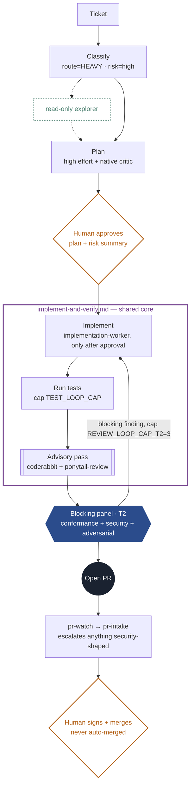
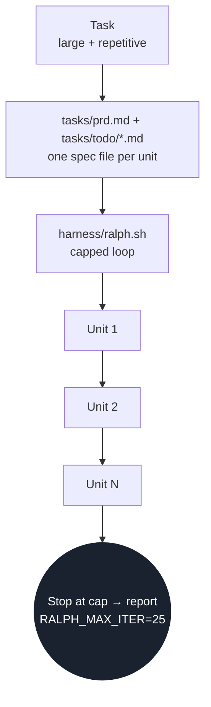
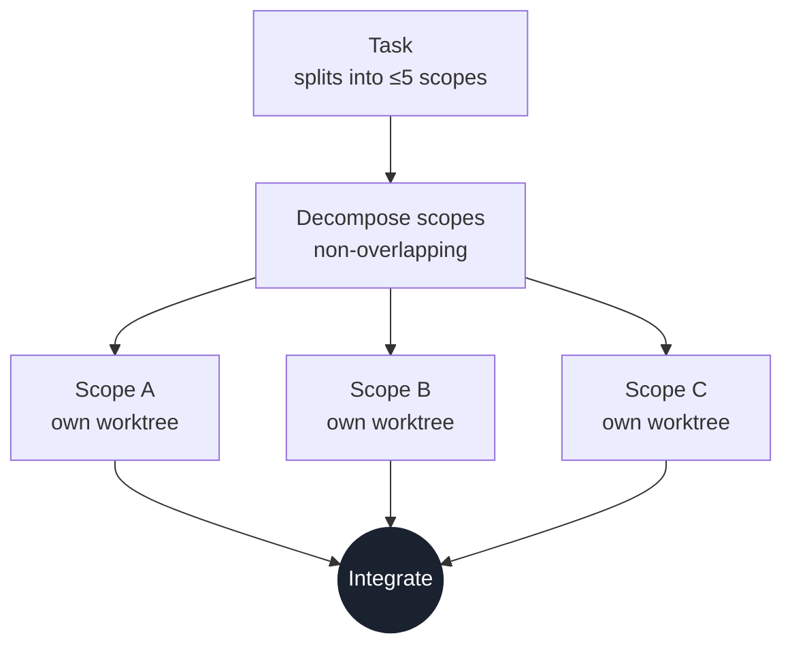
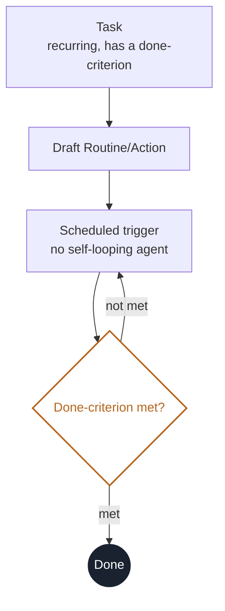
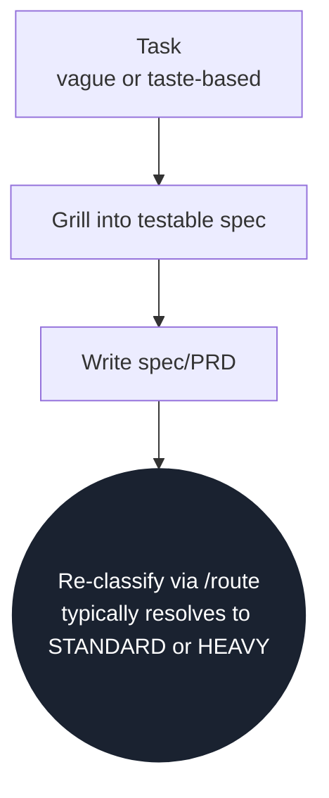
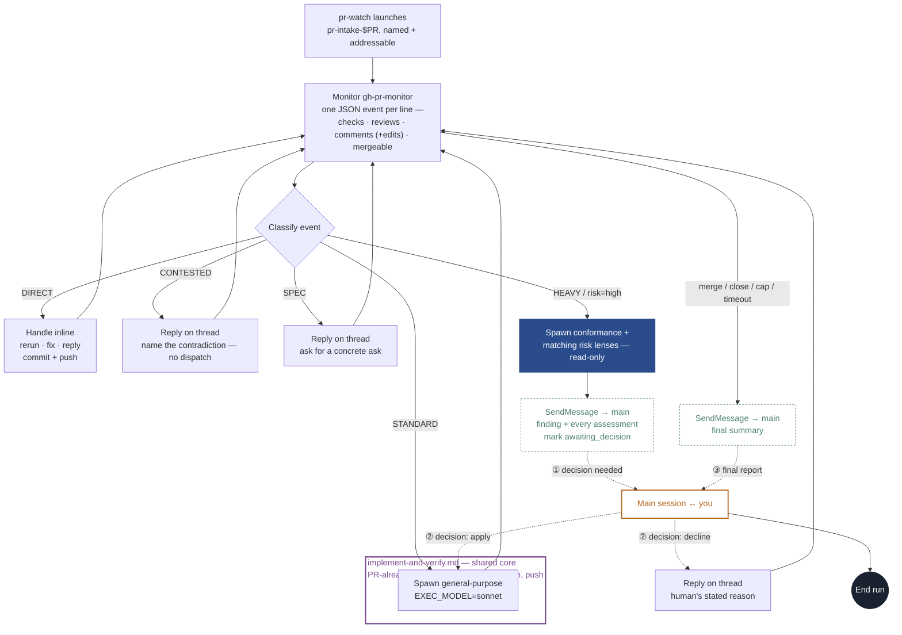

# software-factory

A software factory — a portable specification-execution workflow
plus the routing layer between you and coding CLIs. It owns seven things:

- **implement-spec** — approved spec → exploration → plan → implementation worker → evidence → review
- **triage** — Haiku-priced classification of each task
- **dispatch** — route → workstream + model ladder
- **loop enforcement** — caps, conformance exits, breakers
- **durable state** — resumable per-run artifacts under `.agent-runs/`
- **runtime adapters** — Claude Code, Codex, and OpenCode native entrypoints and agents
- **evaluation** — is the routing right, are the loops healthy, what did it cost

```
models         fable · opus · sonnet · haiku   |   sol · terra · luna
                 ↑
inner          Claude Code CLI · Codex CLI      ← "harness" in benchmark-speak
harnesses        ↑
THIS LAYER     the agentic-engineering harness  ← portable skill · state · gates · adapters
                 ↑
you            specs in · judgment at the gates
```

The authoritative implementation workflow is a portable Agent Skill. This repo
packages one marketplace plugin for **Claude Code and Codex**, an optional
repo-local OpenCode adapter, a terminal launcher, and its own **git
marketplace**. See
[Distribution](#distribution--team--web--desktop).

## Implement an approved spec

```bash
# One-time plugin installation for each runtime you use
claude plugin marketplace add aanojima/software-factory
claude plugin install --scope user software-factory@software-factory
codex plugin marketplace add aanojima/software-factory
codex plugin add software-factory@software-factory
```

Inside an existing session:

```text
/software-factory:implement-spec docs/specs/refunds.md   # Claude Code
$implement-spec Implement docs/specs/refunds.md         # Codex
/implement-spec docs/specs/refunds.md                    # OpenCode, after init --opencode
```

The current host session is the technical lead and workflow owner. It launches
read-only native explorers, synthesizes their findings, applies a second risk
gate, dispatches exactly one implementation worker for writes and repairs, and
obtains independent read-only review. Claude uses the plugin-bundled worker,
Codex its built-in worker, and OpenCode its bundled repo-local worker. Product
requirements remain owned by the supplied spec; technical uncertainty is
resolved through repository exploration.

## Layout

```
├── .claude-plugin/
│   ├── plugin.json               plugin manifest (name/version; auto-discovers below)
│   └── marketplace.json          marketplace manifest (this repo == its marketplace)
├── .codex-plugin/plugin.json     Codex-native manifest for the same skills
├── commands/
│   ├── execute.md                → /software-factory:execute (Claude Code)
│   └── setup.md                  → /software-factory:setup
├── agents/                       Claude plugin explorers + reviewers
├── skills/route/
│   ├── SKILL.md                  the route skill / routing methodology
│   └── classifier.md             Stage-1 triage prompt (JSON out)
├── skills/implement-spec/
│   ├── SKILL.md                  portable workflow / state machine
│   ├── references/               phase contracts loaded as needed
│   ├── schemas/                  readiness, validation, review contracts
│   └── scripts/run_state.py      durable state + completion gates
├── adapters/opencode/            optional OpenCode agent and command definitions
├── bin/
│   └── software-factory           CLI for checkout-based automation
├── harness/
│   ├── loops.env                 caps + model tiers (single source of truth)
│   ├── triage.sh                 Haiku-priced classification
│   ├── implement.sh              thin runtime launcher
│   ├── install-user.sh           native Claude/Codex plugin installer + migration
│   ├── execute.sh                classify + run the safe routes / gate the rest
│   ├── dispatch.sh               route, log, print the next command (never auto-runs)
│   ├── review.sh                 explicit external Codex review bridge
│   ├── ralph.sh                  capped fresh-context loop w/ identical-failure breaker
│   └── init.sh                   wire a consumer repo to the plugin
├── templates/routing-log.md      empty log seeded into consumer repos
├── eval/{golden.jsonl,classify-eval.sh,report.sh}
├── VERSION · CLAUDE.md · AGENTS.md
```

**Engine vs. repo kit.** The plugin carries the reusable skills, commands, and
Claude agents. The per-repo kit contains plugin settings, `CLAUDE.md`/`AGENTS.md`
rules, tasks, and the golden seed. `--opencode` additionally vendors OpenCode's
skills, commands, agents, and loop caps because its plugin format is unrelated. The CLI
keeps engine and target state separate via `SOFTWARE_FACTORY_HOME` and
`AGENTIC_TARGET`.

## Usage — three modes

- **Spec execution.** `software-factory implement <spec> --runtime <host>` starts
  one host session, creates a resumable run directory, and lets the portable
  skill coordinate read-only exploration/review and one implementation worker.
- **Mode A (inline, day one).** In a Claude Code session, type
  `/software-factory:execute <task>` (or `/software-factory:route <task>` to just
  classify). The skill classifies, announces the route, and follows it.
- **Mode B (headless).** `software-factory dispatch "add CSV export to reports"`
  prints the classification JSON, appends the log line, and prints the exact
  next command for you (or a wrapper) to run. Print-only is the safety boundary.
- **Mode C (HEAVY walk-through).** Human gates in force: grill → plan at high
  effort → native plan critic → **human approves** → implementation worker →
  test loop → native review panel → goal-gate the diff → PR → CI →
  **human merges**.

Inline and spec workflows use the current host's native subagents by default.
Codex uses native Codex explorers/reviewers and a native GPT-6 Astra HEAVY plan
critic; Claude uses its native equivalents. The external CLI bridge is only
for a user-requested mixed Claude + Codex review. A native launch failure stops
or retries within the existing cap instead of changing providers.

## Route pipelines

What each `route` level actually runs, end to end. Shapes: `[process]` ·
`{human gate}` · `((terminal))` · a shaded box is a blocking reviewer (counts
toward the review loop cap), a dashed box is advisory (surfaced, never
blocks). The violet-bordered box in DIRECT/STANDARD/HEAVY (and again inside
pr-intake, below) is the same reusable sub-workflow every time —
`references/implement-and-verify.md`'s implement → CI's real test command →
advisory pass — not three different implementations of the same idea.
`DIRECT`/`STANDARD`/`HEAVY` are the three routes `implement-ticket`
covers — one ticket in, one mergeable PR out. The rest are workstreams
`/route` dispatches directly; `implement-ticket` declines to force them into
a single-PR shape.

<details>
<summary><b>DIRECT</b> — tier T0, risk low: trivial, mechanical, one obvious way to do it</summary>



No blocking panel — tests are the gate — but the shared core (violet), the
PR, and `pr-watch` still run. Nothing merges without a PR.

</details>

<details open>
<summary><b>STANDARD</b> — tier T1, risk low–medium: the default, mirrors an existing pattern</summary>



Exploration is a side branch, not a required stop. Only the blocking lens
(the conformance lens) can trigger the capped loop back into the shared
core; the advisory lens inside it never does.

</details>

<details>
<summary><b>HEAVY</b> — tier T2, risk high: auth, payments, money, data integrity, migrations, unknown-cause bugs</summary>



Two hard human gates bracket the pipeline — plan approval and the final
merge. The middle is the same shared core as STANDARD, just followed by
three blocking lenses instead of one.

</details>

<details>
<summary><b>RALPH</b> — tier T4: large but repetitive, a long sequential list of near-identical steps</summary>



Sequential, not parallel — each unit gets its own fresh context, one after
another, until the cap. Not a single PR.

</details>

<details>
<summary><b>SWARM</b> — tier T4: splits into ≤5 independent scopes that run in parallel</summary>



Each lane is single-writer on its own worktree, never shared — the one route
where "agents" is genuinely plural.

</details>

<details>
<summary><b>CRON</b> — a recurring, scheduled chore with an explicit done-criterion</summary>



The loop back to the trigger is external — the clock decides when it runs
again, not the agent.

</details>

<details>
<summary><b>SPEC</b> — underspecified or taste-based, not measurable yet</summary>



Not a dead end — the spec it produces is the input to a second, now-meaningful
classification.

</details>

## Inside pr-intake — how it talks back

Every "pr-watch → pr-intake" step above is one line standing in for this.
`pr-intake` runs as its own background agent and stays alive for the whole
watch — it never stops to ask a question, because it has no tool that could
ask one directly. Instead it uses `SendMessage(to: "main")` to reach the
session that spawned it, then keeps triaging everything else on the PR
while it waits for a reply.

It doesn't poll GitHub itself either: it opens one persistent `Monitor` on
the `gh-pr-monitor` extension, which does its own baseline+diff against
GitHub and emits one JSON event per line for every CI check, review,
comment (new or edited), review request, mergeable-state change, and
description edit. The Monitor only interrupts `pr-intake`'s turn when
something on the PR actually changed — no sleep loop, no backoff to reason
about, and a pending human decision costs nothing while it waits.



The same violet core from DIRECT/STANDARD/HEAVY reappears here — `STANDARD`
and an `apply` decision both spawn the identical `general-purpose` dispatch,
just via different classify branches, because they hand it the same fix
recipe. `pr-intake` is never resumed from a stop — ① and ② are live messages
while it keeps running, not a paused agent waiting to be woken up. It only
actually ends its run at ③, once there's genuinely nothing left on the PR to
watch — either `gh-pr-monitor` exits on its own (the PR left `OPEN`: merged
or closed) or the loop-cap/timeout check after an event trips. Catching
CodeRabbit's edits (not just new comments) at step B matters because
CodeRabbit updates one summary comment in place as commits land, and that
comment can carry pre-merge check failures worth triaging on its own —
`gh-pr-monitor` reports that edit as an ordinary `comment` event, so nothing
extra is needed to catch it. `CONTESTED` and a `decline`d escalation both
reply with a named, specific reason instead of a raw disagreement — the
difference is only who made the call, `pr-intake` itself or you.

## Distribution — team · web · desktop

Install the shared plugin once for each local user:

```bash
claude plugin marketplace add aanojima/software-factory
claude plugin install --scope user software-factory@software-factory
codex plugin marketplace add aanojima/software-factory
codex plugin add software-factory@software-factory
```

`./bin/software-factory install-user` runs those native commands and removes
legacy Software Factory home-directory links and Codex checkout registrations.
It does not leave a dependency on this checkout.

Then configure and commit the small project kit from an installed plugin:

```text
/software-factory:setup init      # Claude Code
$factory-setup init               # Codex
```

```bash
git add -A && git commit -m "Add software-factory"
```

`init` writes `.claude/settings.json` to enable the marketplace plugin for the
project, managed `CLAUDE.md`/`AGENTS.md` rules, state seeds, a version marker,
and the `.agent-runs/` gitignore entry. Codex loads the workflow and built-in
native subagents through the installed plugin; it needs no copied prompts,
skills, agent profiles, or checkout references.

OpenCode is optional and uses a different plugin system. Pass `--opencode` to
the setup command from Claude or Codex to add its repo-local skills, commands,
and agents without creating home-directory links.

The committed `.claude/settings.json` gives Claude Code a shared project-scope
installation. Codex installs the same marketplace package at user scope. In a
new Codex session, use `$route`, `$implement-spec`, `$stage-ticket`,
`$implement-ticket`, or `$pr-watch`.

**Versioning & updates.** Setup pins the marketplace `ref`. The default
is `main`; after a release tag exists, pin a repo with
`$factory-setup update --to v0.2.1` (Codex) or the equivalent namespaced Claude
command. A repo's pinned version lives in
`.claude/.software-factory-version`.

```text
$factory-setup status
$factory-setup update
$factory-setup update --to v0.2.1
```

The update action re-pins `.claude/settings.json`, refreshes the managed project rules,
removes the old vendored Codex kit, and reports the version/ref transition.
State (log, tasks, golden) is left untouched. Use each runtime's native plugin
update command to refresh the user-scoped plugin. Cutting a release: tag the repo, bump
`VERSION` and both plugin manifests, then update each consumer repo. Pin a fork
with `AGENTIC_MARKETPLACE_REPO=you/your-fork`.

## Invoking the harness

**1 · In-session slash command:**

```
/software-factory:execute  add CSV export to reports, matching the PDF export   # Claude Code
$route                    add CSV export to reports                            # Codex
```

Claude Code plugin commands are **namespaced** — it's `/software-factory:execute`
(and `/software-factory:route`), not a bare `/execute`. Rename the plugin in
`.claude-plugin/plugin.json` to shorten the prefix (e.g. `ah` → `/ah:execute`).

**2 · Terminal binary** — optional checkout-based automation:

```bash
./bin/software-factory execute "add CSV export to reports"
./bin/software-factory implement docs/spec.md --runtime codex
./bin/software-factory dispatch "…"
./bin/software-factory triage "…"
```

`execute` auto-runs the safe routes (DIRECT, STANDARD) and **stops with guidance**
for gated / multi-step routes (HEAVY, RALPH, SWARM, CRON, SPEC, or any
`risk=high`) — the print-only safety boundary, preserved for headless runs. Pick
the classifier, executor, and native-agent family with
`AGENTIC_EXECUTOR=claude|codex` (default `claude`).

**3 · Direct CLI** — headless:

```bash
claude -p "/software-factory:execute add CSV export to reports"   # VERIFY: slash expansion in -p
codex exec '$route add CSV export to reports'
```

For scripted/unattended use prefer the binary — it enforces the risk gate before
any agent runs.

`implement` supports `--headless`, `--run-id`, and `--run-dir` for resuming an
existing run. Local state is structured as:

```text
.agent-runs/<run-id>/
├── run.json
├── spec.snapshot.md
├── readiness.json
├── exploration/
├── implementation-plan.md
├── validation.json
├── reviews/
└── final-summary.md
```

The launcher does not orchestrate individual phases. Claude Code, Codex, or
OpenCode remains the host orchestrator. Plugin users do not need the terminal
launcher or a source checkout after installation.

## Before the first unattended run

The scripts are deliberately small; CLI flags drift, so anything marked
`# VERIFY` should be checked against `--help` first. Harden per
[the bootstrap doc's checklist](#): branch protection on `main` (require PR +
CI), native subagent smoke tests pass, `ralph.sh` is sandboxed with its breaker
tested, and billing alerts are armed. For explicit mixed Claude + Codex review,
also authenticate both CLIs and check that `review.sh` returns valid JSON on a
toy diff.

## Evaluator gates

- **Routing accuracy** ≥85% on the golden set before trusting Mode B unattended.
  Rerun `eval/classify-eval.sh` after every `classifier.md` edit; misses from
  real use become new golden cases.
- **System health** (`eval/report.sh`): cap-hit rate < 10%, ceremony share ≤15%
  of spend on T1s, escalations-to-SPEC should outnumber escalations-to-bigger-model.

## Development checks

```bash
tests/test.sh
```

The suite validates shell syntax, manifests and schemas, durable state
transitions/completion gates, single-writer enforcement, and consumer-repo
installation for all three runtime adapters.
