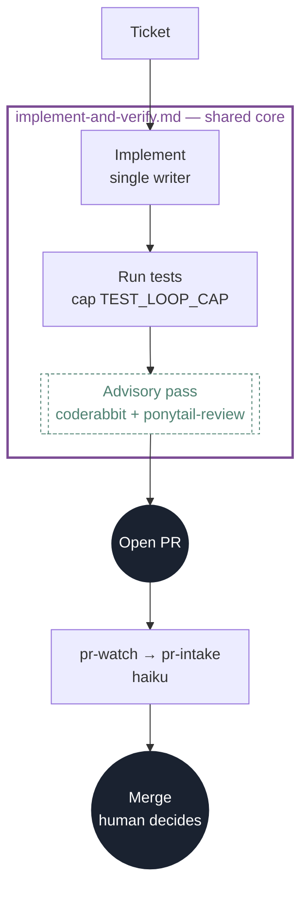
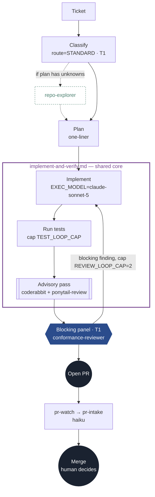
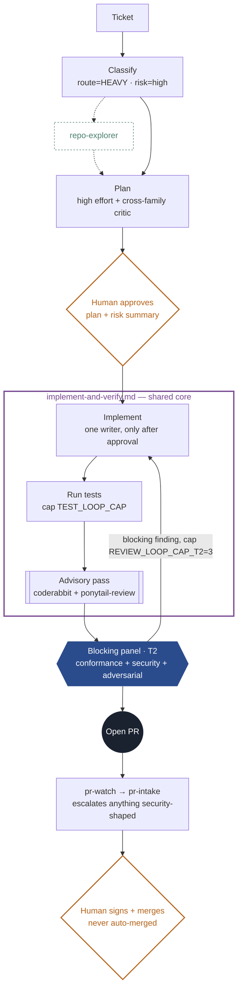
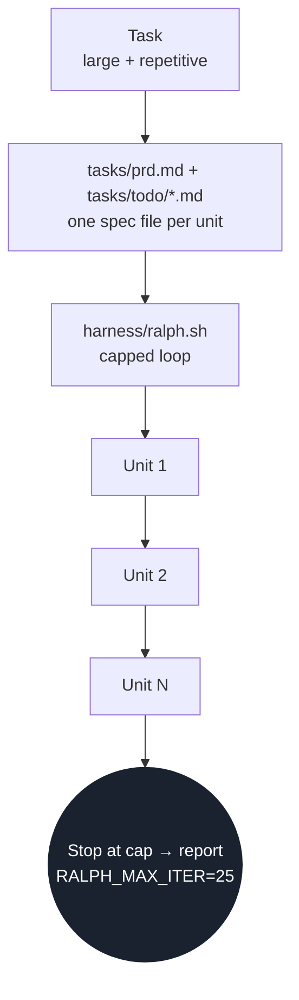
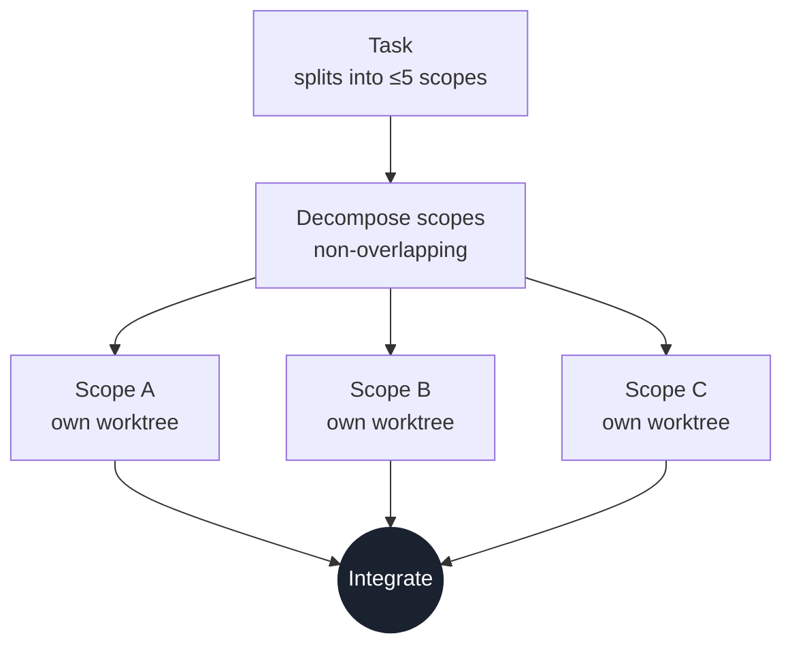
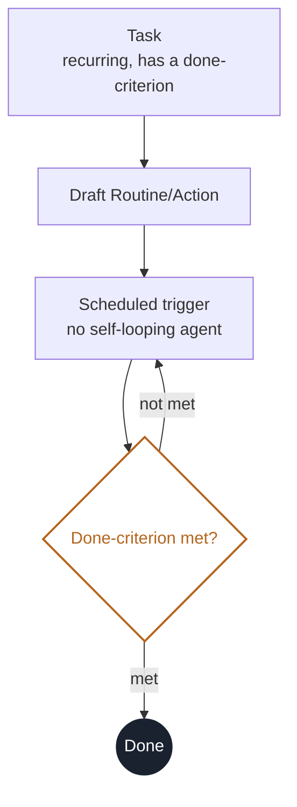
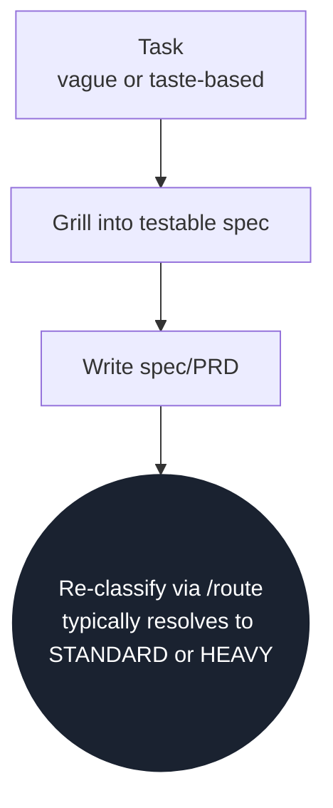
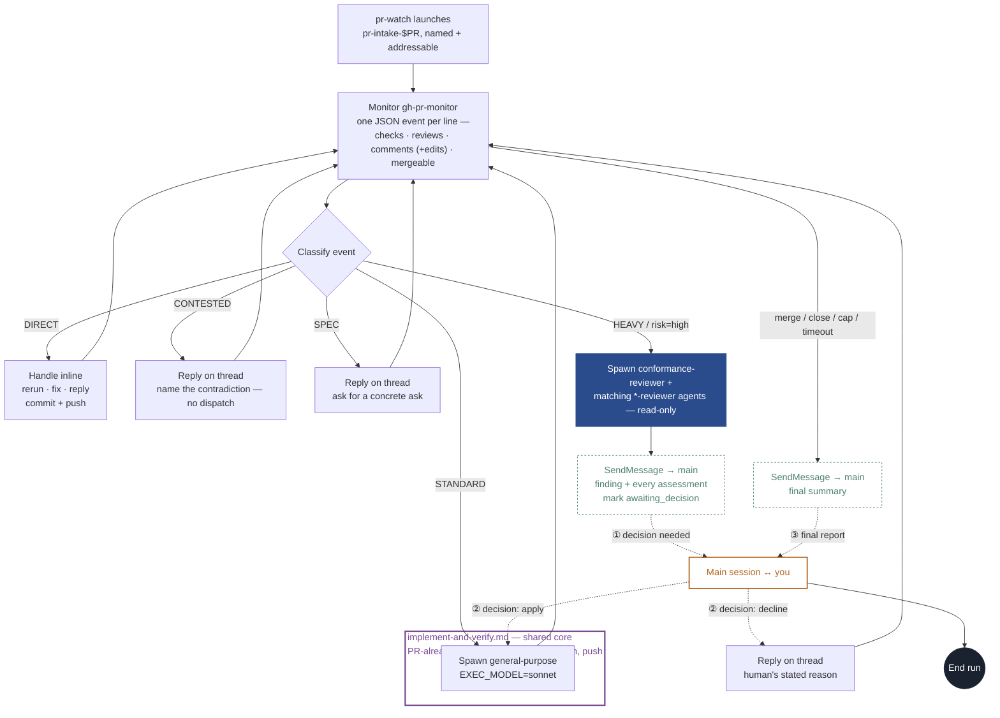

# software-factory

A software factory — a portable specification-execution workflow
plus the routing layer between you and coding CLIs. It owns seven things:

- **implement-spec** — approved spec → exploration → plan → one writer → evidence → review
- **triage** — Haiku-priced classification of each task
- **dispatch** — route → workstream + model ladder
- **loop enforcement** — caps, conformance exits, breakers
- **durable state** — resumable per-run artifacts under `.agent-runs/`
- **runtime adapters** — Claude Code, Codex, and OpenCode native entrypoints and agents
- **evaluation** — is the routing right, are the loops healthy, what did it cost

```
models         fable · opus · sonnet · haiku   |   sol · terra · luna
                 ↑
inner          Claude Code CLI · Codex CLI      ← "harness" in benchmark-speak
harnesses        ↑
THIS LAYER     the agentic-engineering harness  ← portable skill · state · gates · adapters
                 ↑
you            specs in · judgment at the gates
```

The authoritative implementation workflow is a portable Agent Skill. This repo
also packages a **Claude Code plugin**, Codex/OpenCode adapters, a terminal
launcher, and its own **git marketplace**. See
[Distribution](#distribution--team--web--desktop).

## Implement an approved spec

```bash
# One-time personal installation across local repositories
software-factory install-user

# Start the workflow in a selected host runtime
software-factory implement docs/specs/refunds.md --runtime claude
software-factory implement docs/specs/refunds.md --runtime codex
software-factory implement docs/specs/refunds.md --runtime opencode
```

Inside an existing session:

```text
/software-factory:implement-spec docs/specs/refunds.md   # Claude Code
$implement-spec Implement docs/specs/refunds.md         # Codex
/implement-spec docs/specs/refunds.md                    # OpenCode
```

The current host session is the technical lead and default sole writer. It
launches read-only native explorers, synthesizes their findings, applies a
second risk gate, implements, validates every acceptance criterion, and obtains
independent read-only review. Product requirements remain owned by the supplied
spec; technical uncertainty is resolved through repository exploration.

## Layout

```
├── .claude-plugin/
│   ├── plugin.json               plugin manifest (name/version; auto-discovers below)
│   └── marketplace.json          marketplace manifest (this repo == its marketplace)
├── commands/
│   └── execute.md                → /software-factory:execute (Claude Code)
├── agents/                       Claude plugin explorers + reviewers
├── skills/route/
│   ├── SKILL.md                  the route skill / routing methodology
│   └── classifier.md             Stage-1 triage prompt (JSON out)
├── skills/implement-spec/
│   ├── SKILL.md                  portable workflow / state machine
│   ├── references/               phase contracts loaded as needed
│   ├── schemas/                  readiness, validation, review contracts
│   └── scripts/run_state.py      durable state + completion gates
├── adapters/{codex,opencode}/    native agent and command definitions
├── bin/
│   └── software-factory           CLI — on PATH via the plugin, or symlink it
├── harness/
│   ├── loops.env                 caps + model tiers (single source of truth)
│   ├── triage.sh                 Haiku-priced classification
│   ├── implement.sh              thin runtime launcher
│   ├── install-user.sh           global local-machine installation
│   ├── execute.sh                classify + run the safe routes / gate the rest
│   ├── dispatch.sh               route, log, print the next command (never auto-runs)
│   ├── review.sh                 one cross-family conformance-review round
│   ├── ralph.sh                  capped fresh-context loop w/ identical-failure breaker
│   └── init.sh                   wire a consumer repo to the plugin + Codex
├── .codex/prompts/               Codex execute + implement-spec entrypoints
├── templates/routing-log.md      empty log seeded into consumer repos
├── eval/{golden.jsonl,classify-eval.sh,report.sh}
├── VERSION · CLAUDE.md · AGENTS.md
```

**Engine vs. repo kit.** The engine (`bin/`, `harness/`, `eval/`, `skills/`,
`agents/`, `adapters/`, `commands/`) is shared once. The per-repo kit
(`.claude/settings.json`, `.codex/prompts/`, `CLAUDE.md`/`AGENTS.md` blocks,
`.agents/skills/`, runtime agents, `tasks/`, golden seed) is stamped into each consumer repo by
`software-factory init` and committed there. The CLI keeps these separate via
`SOFTWARE_FACTORY_HOME` (engine) and `AGENTIC_TARGET` (the repo the task runs in).

## Usage — three modes

- **Spec execution.** `software-factory implement <spec> --runtime <host>` starts
  one host session, creates a resumable run directory, and lets the portable
  skill coordinate native read-only workers and one writer.
- **Mode A (inline, day one).** In a Claude Code session, type
  `/software-factory:execute <task>` (or `/software-factory:route <task>` to just
  classify). The skill classifies, announces the route, and follows it.
- **Mode B (headless).** `software-factory dispatch "add CSV export to reports"`
  prints the classification JSON, appends the log line, and prints the exact
  next command for you (or a wrapper) to run. Print-only is the safety boundary.
- **Mode C (HEAVY walk-through).** Human gates in force: grill → plan at high
  effort → **human approves** → cheap executor implements → test loop → conformance
  review (both families) → goal-gate the diff → PR → CI → **human merges**.

## Route pipelines

What each `route` level actually runs, end to end. Shapes: `[process]` ·
`{human gate}` · `((terminal))` · a shaded box is a blocking reviewer (counts
toward the review loop cap), a dashed box is advisory (surfaced, never
blocks). The violet-bordered box in DIRECT/STANDARD/HEAVY (and again inside
pr-intake, below) is the same reusable sub-workflow every time —
`references/implement-and-verify.md`'s implement → CI's real test command →
advisory pass — not three different implementations of the same idea.
`DIRECT`/`STANDARD`/`HEAVY` are the three routes `implement-ticket`
covers — one ticket in, one mergeable PR out. The rest are workstreams
`/route` dispatches directly; `implement-ticket` declines to force them into
a single-PR shape.

<details>
<summary><b>DIRECT</b> — tier T0, risk low: trivial, mechanical, one obvious way to do it</summary>



No blocking panel — tests are the gate — but the shared core (violet), the
PR, and `pr-watch` still run. Nothing merges without a PR.

</details>

<details open>
<summary><b>STANDARD</b> — tier T1, risk low–medium: the default, mirrors an existing pattern</summary>



Exploration is a side branch, not a required stop. Only the blocking lens
(`conformance-reviewer`) can trigger the capped loop back into the shared
core; the advisory lens inside it never does.

</details>

<details>
<summary><b>HEAVY</b> — tier T2, risk high: auth, payments, money, data integrity, migrations, unknown-cause bugs</summary>



Two hard human gates bracket the pipeline — plan approval and the final
merge. The middle is the same shared core as STANDARD, just followed by
three blocking lenses instead of one.

</details>

<details>
<summary><b>RALPH</b> — tier T4: large but repetitive, a long sequential list of near-identical steps</summary>



Sequential, not parallel — each unit gets its own fresh context, one after
another, until the cap. Not a single PR.

</details>

<details>
<summary><b>SWARM</b> — tier T4: splits into ≤5 independent scopes that run in parallel</summary>



Each lane is single-writer on its own worktree, never shared — the one route
where "agents" is genuinely plural.

</details>

<details>
<summary><b>CRON</b> — a recurring, scheduled chore with an explicit done-criterion</summary>



The loop back to the trigger is external — the clock decides when it runs
again, not the agent.

</details>

<details>
<summary><b>SPEC</b> — underspecified or taste-based, not measurable yet</summary>



Not a dead end — the spec it produces is the input to a second, now-meaningful
classification.

</details>

## Inside pr-intake — how it talks back

Every "pr-watch → pr-intake" step above is one line standing in for this.
`pr-intake` runs as its own background agent and stays alive for the whole
watch — it never stops to ask a question, because it has no tool that could
ask one directly. Instead it uses `SendMessage(to: "main")` to reach the
session that spawned it, then keeps triaging everything else on the PR
while it waits for a reply.

It doesn't poll GitHub itself either: it opens one persistent `Monitor` on
the `gh-pr-monitor` extension, which does its own baseline+diff against
GitHub and emits one JSON event per line for every CI check, review,
comment (new or edited), review request, mergeable-state change, and
description edit. The Monitor only interrupts `pr-intake`'s turn when
something on the PR actually changed — no sleep loop, no backoff to reason
about, and a pending human decision costs nothing while it waits.



The same violet core from DIRECT/STANDARD/HEAVY reappears here — `STANDARD`
and an `apply` decision both spawn the identical `general-purpose` dispatch,
just via different classify branches, because they hand it the same fix
recipe. `pr-intake` is never resumed from a stop — ① and ② are live messages
while it keeps running, not a paused agent waiting to be woken up. It only
actually ends its run at ③, once there's genuinely nothing left on the PR to
watch — either `gh-pr-monitor` exits on its own (the PR left `OPEN`: merged
or closed) or the loop-cap/timeout check after an event trips. Catching
CodeRabbit's edits (not just new comments) at step B matters because
CodeRabbit updates one summary comment in place as commits land, and that
comment can carry pre-merge check failures worth triaging on its own —
`gh-pr-monitor` reports that edit as an ordinary `comment` event, so nothing
extra is needed to catch it. `CONTESTED` and a `decline`d escalation both
reply with a named, specific reason instead of a raw disagreement — the
difference is only who made the call, `pr-intake` itself or you.

## Distribution — team · web · desktop

The harness reaches every surface by committing a small kit into each repo. Run
this once per target repo, from its root:

```bash
software-factory init            # wires the plugin + Codex + seeds state
git add -A && git commit -m "Add software-factory"   # web/desktop read committed files
```

`init` writes:
- `.claude/settings.json` → registers this repo as a marketplace
  (`extraKnownMarketplaces`) and enables the plugin (`enabledPlugins`). Committed,
  so **Claude Code CLI, web, and desktop** all install it at session start
  (needs network to reach the marketplace repo + repo trust).
- `.codex/prompts/` + an `AGENTS.md` block → committed **Codex** entrypoints
  and a portable fallback independent of plugin installation.
- `.agents/skills/implement-spec/` → portable skill used by Codex and OpenCode.
- `.codex/agents/` + managed `.codex/config.toml` registrations → native
  read-only Codex roles.
- `.opencode/{commands,agents}/` → native OpenCode command and roles.
- `CLAUDE.md` block, `tasks/{todo,done}/`, an `eval/golden.jsonl` seed, and a
  `.claude/.software-factory-version` marker.
- `.gitignore` entry for local `.agent-runs/` execution evidence.

**Install scopes** (Claude Code plugins): the committed `.claude/settings.json`
is **project (shared)** scope — the whole team gets it. For personal use you can
also `/plugin marketplace add aanojima/software-factory` then `/plugin install
software-factory@software-factory` at **user** scope (`~/.claude`, CLI-only) or
**project-local** scope (`.claude/settings.local.json`, gitignored).

**Versioning & updates.** `init`/`update` pin the marketplace `ref`. The default
is **`main`** (safe until the first release tag is pushed); switch the default in
`harness/init.sh` to `v0.2.0` once that tag exists, or pin per-repo with
`software-factory update --to v0.2.0`. A repo's pinned version lives in
`.claude/.software-factory-version`.

```bash
software-factory status            # show this repo's pinned version/ref vs the engine
software-factory update            # re-pin to the engine's default release + refresh managed files
software-factory update --to v0.2.0   # roll this repo to a specific release
```

`update` re-pins `.claude/settings.json`, refreshes the Codex prompt and the
`CLAUDE.md`/`AGENTS.md` blocks, and reports the `version`/`ref` transition —
**state (log, tasks, golden) is left untouched**. Committing the changed
`settings.json` makes Claude Code re-install the plugin at the new ref on the
next session (CLI + web + desktop). Cutting a release: tag the repo (`git tag
vX.Y.Z`), bump `VERSION` + the default ref in `harness/init.sh`, then run
`software-factory update` in each consumer repo (or `--to vX.Y.Z`). Pin a fork
with `AGENTIC_MARKETPLACE_REPO=you/your-fork`.

## Invoking the harness

**1 · In-session slash command:**

```
/software-factory:execute  add CSV export to reports, matching the PDF export   # Claude Code
/execute                  add CSV export to reports                            # Codex
```

Claude Code plugin commands are **namespaced** — it's `/software-factory:execute`
(and `/software-factory:route`), not a bare `/execute`. Rename the plugin in
`.claude-plugin/plugin.json` to shorten the prefix (e.g. `ah` → `/ah:execute`).

**2 · Terminal binary** — shipped on PATH by the plugin; or symlink for dev:

```bash
ln -sf "$PWD/bin/software-factory" /usr/local/bin/software-factory   # dev checkout only
software-factory execute "add CSV export to reports"   # runs on the CURRENT repo
software-factory implement docs/spec.md --runtime codex # approved-spec workflow
software-factory dispatch "…"   # classify + print next step, never runs
software-factory triage "…"     # JSON only
software-factory report | eval | review <plan> | ralph
```

`execute` auto-runs the safe routes (DIRECT, STANDARD) and **stops with guidance**
for gated / multi-step routes (HEAVY, RALPH, SWARM, CRON, SPEC, or any
`risk=high`) — the print-only safety boundary, preserved for headless runs. Pick
the executor family with `AGENTIC_EXECUTOR=claude|codex` (default `claude`).

**3 · Direct CLI** — headless:

```bash
claude -p "/software-factory:execute add CSV export to reports"   # VERIFY: slash expansion in -p
codex exec "$(cat .codex/prompts/execute.md)"                    # substitute the task for $ARGUMENTS
```

For scripted/unattended use prefer the binary — it enforces the risk gate before
any agent runs.

`implement` supports `--headless`, `--run-id`, and `--run-dir` for resuming an
existing run. Local state is structured as:

```text
.agent-runs/<run-id>/
├── run.json
├── spec.snapshot.md
├── readiness.json
├── exploration/
├── implementation-plan.md
├── validation.json
├── reviews/
└── final-summary.md
```

The launcher does not orchestrate individual phases. Claude Code, Codex, or
OpenCode remains the host orchestrator, so the same workflow can run inside an
existing desktop/terminal session. Commit the vendored repo kit for remote or
cloud environments that cannot read machine-global skills.

`install-user` places the common skill in both Claude and Agent Skills discovery
locations. Because OpenCode reads both, set
`OPENCODE_DISABLE_CLAUDE_CODE_SKILLS=1` if your OpenCode version reports a
duplicate `implement-spec` skill; it will continue using the `.agents` copy.

## Before the first unattended run

The scripts are deliberately small; CLI flags drift, so anything marked
`# VERIFY` should be checked against `--help` first. Harden per
[the bootstrap doc's checklist](#): branch protection on `main` (require PR +
CI), both CLIs authenticated, `review.sh` returns valid JSON on a toy diff,
`ralph.sh` sandboxed with its breaker tested, billing alerts armed.

## Evaluator gates

- **Routing accuracy** ≥85% on the golden set before trusting Mode B unattended.
  Rerun `eval/classify-eval.sh` after every `classifier.md` edit; misses from
  real use become new golden cases.
- **System health** (`eval/report.sh`): cap-hit rate < 10%, ceremony share ≤15%
  of spend on T1s, escalations-to-SPEC should outnumber escalations-to-bigger-model.

## Development checks

```bash
tests/test.sh
```

The suite validates shell syntax, manifests and schemas, durable state
transitions/completion gates, single-writer enforcement, and consumer-repo
installation for all three runtime adapters.
